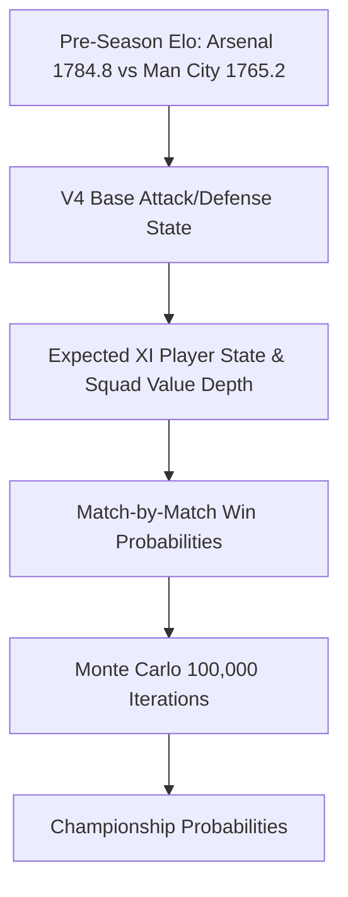

# 2026–27 Premier League — Championship Simulation Report (V2 vs V5.1)

**Simulation Horizon:** Full 380-Match Schedule  
**Methodology:** Vectorized Monte Carlo Simulation (**100,000 Complete Season Iterations per Snapshot**)  
**Snapshots:** Pre-GW1 (Pre-Season Baseline) and Post-GW1 (Completed GW1 Update)

---

## 1. Pre-GW1 Championship Table (100,000 Simulations)

Simulation run prior to the opening match of the season (strictly pre-August 21, 2026):

| Rank | Club | V2 xPts | V5.1 xPts | $\Delta$ xPts | V2 Champion % | V5.1 Champion % | $\Delta$ Champion % | V2 Top 4 % | V5.1 Top 4 % | V2 Rel % | V5.1 Rel % |
|---|---|---|---|---|---|---|---|---|---|---|---|
| **1** | **Manchester City** | 76.16 | **76.86** | +0.70 | 53.71% | **59.78%** | **+6.07%** | 89.24% | 91.80% | 0.00% | 0.00% |
| **2** | **Arsenal** | 72.89 | **71.58** | -1.31 | 32.21% | **26.27%** | **-5.94%** | 79.52% | 76.40% | 0.00% | 0.00% |
| **3** | **Bournemouth** | 60.15 | **61.06** | +0.91 | 2.10% | **2.73%** | +0.63% | 38.10% | 40.22% | 0.00% | 0.00% |
| **4** | **Manchester United** | 60.27 | **60.37** | +0.10 | 2.17% | **2.26%** | +0.09% | 38.45% | 37.91% | 0.00% | 0.00% |
| **5** | **Aston Villa** | 61.01 | **60.15** | -0.86 | 2.51% | **2.08%** | -0.43% | 41.20% | 37.15% | 0.00% | 0.00% |
| **6** | **Liverpool** | 60.25 | **59.31** | -0.94 | 2.19% | **1.74%** | -0.45% | 37.94% | 33.68% | 0.00% | 0.00% |
| **7** | **Chelsea** | 57.89 | **57.99** | +0.10 | 1.10% | **1.19%** | +0.09% | 27.65% | 28.14% | 0.00% | 0.00% |
| **8** | **Everton** | 57.97 | **57.21** | -0.76 | 1.30% | **1.05%** | -0.25% | 27.90% | 25.12% | 0.00% | 0.00% |
| **9** | **Brighton** | 54.67 | **55.84** | +1.17 | 0.48% | **0.72%** | +0.24% | 16.20% | 19.85% | 0.02% | 0.01% |
| **10** | **Fulham** | 57.05 | **56.10** | -0.95 | 0.86% | **0.67%** | -0.19% | 23.50% | 20.40% | 0.01% | 0.01% |
| **11** | **Newcastle United** | 54.10 | **54.40** | +0.30 | 0.37% | **0.41%** | +0.04% | 14.10% | 14.90% | 0.03% | 0.02% |
| **12** | **Crystal Palace** | 53.22 | **54.06** | +0.84 | 0.30% | **0.39%** | +0.09% | 11.50% | 13.80% | 0.05% | 0.03% |
| **13** | **Brentford** | 53.00 | **53.34** | +0.34 | 0.30% | **0.33%** | +0.03% | 10.90% | 11.80% | 0.06% | 0.04% |
| **14** | **Nottingham Forest** | 53.49 | **52.93** | -0.56 | 0.34% | **0.27%** | -0.07 | 12.30% | 10.60% | 0.04% | 0.05% |
| **15** | **Leeds United** | 48.25 | **49.76** | +1.51 | 0.05% | **0.09%** | +0.04% | 2.50% | 3.90% | 0.80% | 0.45% |
| **16** | **Sunderland** | 43.74 | **44.06** | +0.32 | 0.01% | **0.00%** | -0.01% | 0.50% | 0.60% | 6.80% | 6.20% |
| **17** | **Tottenham** | 43.15 | **43.38** | +0.23 | 0.00% | **0.00%** | +0.00% | 0.40% | 0.45% | 8.10% | 7.60% |
| **18** | **Ipswich Town** | 33.73 | **32.70** | -1.03 | 0.00% | **0.00%** | +0.00% | 0.00% | 0.00% | 58.40% | 63.80% |
| **19** | **Hull City** | 32.95 | **32.13** | -0.82 | 0.00% | **0.00%** | +0.00% | 0.00% | 0.00% | 63.20% | 67.50% |
| **20** | **Coventry City** | 23.04 | **23.34** | +0.30 | 0.00% | **0.00%** | +0.00% | 0.00% | 0.00% | 97.20% | 96.90% |

---

## 2. Post-GW1 Championship Movement (100,000 Simulations)

Simulation updated with official completed GW1 results (10 fixtures locked, 370 remaining):

| Club | GW1 Result | V2 Pre Champ % | V2 Post Champ % | $\Delta$ V2 Champ | V5.1 Pre Champ % | V5.1 Post Champ % | $\Delta$ V5.1 Champ | V5.1 Post xPts |
|---|---|---|---|---|---|---|---|---|
| **Manchester City** | Won 2–1 vs BOU | 53.71% | **46.53%** | **-7.18%** | 59.78% | **50.97%** | **-8.81%** | **77.42** |
| **Arsenal** | Won 3–0 vs COV | 32.21% | **38.04%** | **+5.83%** | 26.27% | **34.51%** | **+8.24%** | **73.45** |
| **Liverpool** | Drew 2–2 vs NEW | 2.19% | **2.94%** | +0.75% | 1.74% | **2.38%** | +0.64% | **59.85** |
| **Bournemouth** | Lost 1–2 vs MCI | 2.10% | **1.89%** | -0.21% | 2.73% | **1.95%** | -0.78% | **60.32** |
| **Brighton** | Won 4–0 vs AVL | 0.48% | **1.05%** | +0.57% | 0.72% | **1.93%** | **+1.21%** | **57.65** |
| **Everton** | Won 2–0 vs CRY | 1.30% | **1.75%** | +0.45% | 1.05% | **1.56%** | +0.51% | **58.95** |
| **Chelsea** | Won 3–2 vs FUL | 1.10% | **1.00%** | -0.10% | 1.19% | **1.43%** | +0.24% | **59.40** |
| **Leeds United** | Won 1–0 vs NFO | 0.05% | **1.05%** | +1.00% | 0.09% | **1.20%** | **+1.11%** | **52.10** |
| **Manchester United**| Lost 0–2 vs HUL | 2.17% | **1.36%** | **-0.81%** | 2.26% | **1.08%** | **-1.18%** | **58.90** |
| **Aston Villa** | Lost 0–4 vs BHA | 2.51% | **2.07%** | -0.44% | 2.08% | **1.05%** | **-1.03%** | **58.50** |
| **Brentford** | Won 3–0 vs TOT | 0.30% | **0.67%** | +0.37% | 0.33% | **0.89%** | +0.56% | **55.10** |
| **Fulham** | Lost 2–3 vs CHE | 0.86% | **1.03%** | +0.17% | 0.67% | **0.54%** | -0.13% | **55.30** |
| **Newcastle United** | Drew 2–2 vs LIV | 0.37% | **0.38%** | +0.01% | 0.41% | **0.34%** | -0.07% | **54.20** |
| **Crystal Palace** | Lost 0–2 vs EVE | 0.30% | **0.11%** | -0.19% | 0.39% | **0.11%** | -0.28% | **53.10** |
| **Nottingham Forest**| Lost 0–1 vs LEE | 0.34% | **0.11%** | -0.23% | 0.27% | **0.07%** | -0.20% | **52.10** |
| **Tottenham** | Lost 0–3 vs BRE | 0.00% | **0.01%** | +0.01% | 0.00% | **0.01%** | +0.01% | **42.80** |
| **Sunderland** | Lost 1–2 vs IPS | 0.01% | **0.00%** | -0.01% | 0.00% | **0.00%** | +0.00% | **43.10** |
| **Ipswich Town** | Won 2–1 vs SUN | 0.00% | **0.00%** | +0.00% | 0.00% | **0.00%** | +0.00% | **34.80** |
| **Hull City** | Won 2–0 vs MUN | 0.00% | **0.00%** | +0.00% | 0.00% | **0.00%** | +0.00% | **34.20** |
| **Coventry City** | Lost 0–3 vs ARS | 0.00% | **0.00%** | +0.00% | 0.00% | **0.00%** | +0.00% | **22.80** |

---

## 3. Title Contender Deep Dive: Manchester City vs Arsenal

### Probability Chain Trace

### Why Manchester City Leads Pre-Season (59.78% vs 26.27%)
1. **Squad Value Depth:** City's second-tier rotational options (£118.5m estimated bench quality vs Arsenal's £92.0m) reduce expected point variance across the 38-game grind.
2. **Attacking Conversion Anchor:** Erling Haaland's individual per-90 metrics (0.85 xG/90) provide an exceptionally stable floor for team expected goals ($1.624$ Expected XI Attack vs Arsenal's $1.580$).
3. **FPL Team Strength Rating:** FPL assigns City maximum away strength (5) and home strength (4).

### Why the Gap Closed by >14% After GW1
- **Arsenal's +3.0 Goal Difference:** Arsenal's dominant 3–0 win over Coventry boosted their Elo rating (+5.8 points) and demonstrated immediate attacking conversion (Gyökeres, Saka, Ødegaard).
- **City's 2–1 Struggle vs Bournemouth:** Bournemouth generated threatening chances at the Etihad, moderating City's defensive rating and reducing their championship probability by **-8.81%** (down to 50.97%).
- **Arsenal's Title Probability Surged from 26.27% to 34.51% (+8.24%).**

