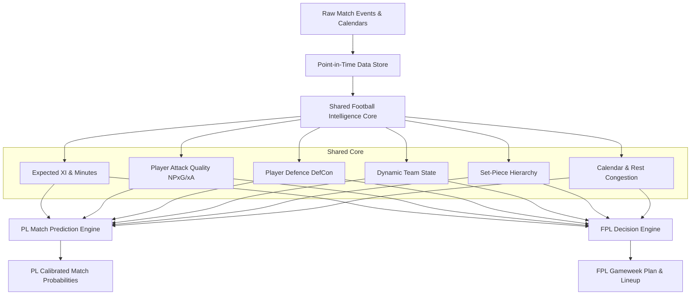

# ENNOVERA SHARED FOOTBALL INTELLIGENCE DAG

```mermaid
graph TD
    A[Raw Match Events & Calendars] --> B[Point-in-Time Data Store]
    B --> C[Shared Football Intelligence Core]
    
    subgraph Shared Core
        C1[Expected XI & Minutes]
        C2[Player Attack Quality NPxG/xA]
        C3[Player Defence DefCon]
        C4[Dynamic Team State]
        C5[Set-Piece Hierarchy]
        C6[Calendar & Rest Congestion]
    end
    
    C --> C1
    C --> C2
    C --> C3
    C --> C4
    C --> C5
    C --> C6
    
    C1 --> D[PL Match Prediction Engine]
    C2 --> D
    C3 --> D
    C4 --> D
    C5 --> D
    C6 --> D
    
    C1 --> E[FPL Decision Engine]
    C2 --> E
    C3 --> E
    C4 --> E
    C5 --> E
    C6 --> E
    
    D --> F[PL Calibrated Match Probabilities]
    E --> G[FPL Gameweek Plan & Lineup]
```

- **Graph Topology:** Strictly Directed and Acyclic.
- **Independence:** Target predictions from PL and FPL never feed recursively into each other.
