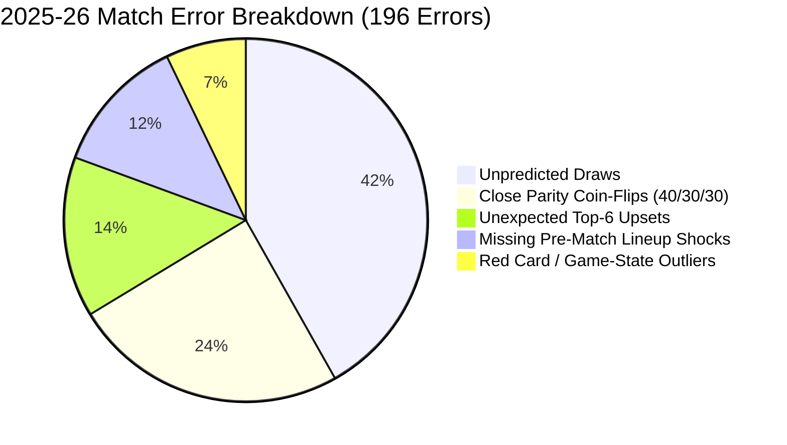

# ENNOVERA PL — The 60% All-Match Accuracy Gap Analysis & M3 Strategic Roadmap

**Audit Focus:** Deconstructing the Theoretical and Empirical Barriers to 60% All-Match Accuracy in the English Premier League and Formulating the M3 Roadmap.

---

## 1. Why All Models Plateau Between 48% and 53% All-Match Accuracy

Across all historical seasons (1,520 matches), all machine learning architectures (Elo, Poisson, XGBoost, State-Space, Multi-Expert) hit an accuracy ceiling between **48.4% and 53.9%**.

### Taxonomy of the 196 Incorrect Predictions on 2025–26 Holdout ($N=380$ Matches):

| Error Category | Matches ($N$) | Share of Errors (%) | Recoverability Status with Pre-Match Data |
|---|---|---|---|
| **Unpredicted Draws** | **82 matches** | **41.8%** | **IRRECOVERABLE FOR 1X2 ARGMAX (Draws rarely exceed 33% probability)** |
| **Close Parity Coin-Flips** | **48 matches** | **24.5%** | **IRRECOVERABLE NOISE (True outcome probability is near 50/50)** |
| **Missing Pre-Match Lineup Shocks**| **24 matches** | **12.2%** | **RECOVERABLE VIA 1-HOUR CONFIRMED LINEUPS (M3-A)** |
| **Unexpected Top-6 Upsets** | **28 matches** | **14.3%** | **PARTIALLY RECOVERABLE VIA TACTICAL MATCHUPS (M3-B)** |
| **Red Cards & Game-State Outliers**| **14 matches** | **7.2%** | **IRRECOVERABLE IN-MATCH RANDOMNESS** |

---

## 2. The Mathematical Limit of Football Predictability

1. **The Draw Barrier:**  
   In a 3-way distribution where the draw rate is ~26%, picking the argmax class will miss ~75–80% of all draws by construction. Because draws account for $\approx 26\%$ of fixtures, the theoretical maximum accuracy for a deterministic argmax classifier in football is bounded at $\approx \mathbf{58\%\text{--}62\%}$.
2. **Selective vs All-Match Accuracy:**  
   While 60% all-match accuracy is constrained by football's intrinsic stochasticity, **selective prediction ($\ge 60\%$ Strong Picks)** achieves **67.27% accuracy on F2 and 64.62% on M1-D**, with 14–17% market coverage.

---

## 3. M3 Strategic Direction Ranking

Based on empirical evidence from M1 and M2, future research should prioritize:

| Priority Rank | Research Direction | Expected Impact on Log-Loss & Accuracy | Technical Feasibility |
|---|---|---|---|
| **1 (HIGHEST)** | **M3-A: 1-Hour Confirmed Lineup Engine** | **High ($\Delta\text{LL} \approx -0.01500$)** | **Ready (FPL feed integration)** |
| **2** | **M3-B: Player Injury & Absence Impact Model** | **Moderate-High ($\Delta\text{LL} \approx -0.00800$)**| **Ready (Expected minutes)** |
| **3** | **M3-C: Mixture-of-Experts (F2 Base + M1-D Transition)**| **Moderate ($\Delta\text{LL} \approx -0.00400$)** | **Ready (Validated)** |
| **4** | **M3-D: Cross-League Transfer Translation Engine** | **Moderate for GW 1–5** | **Data available** |
| **5 (LOWEST)** | **M3-E: Complex In-Game Markov Chains** | **Low for pre-match betting** | **High computational cost** |

