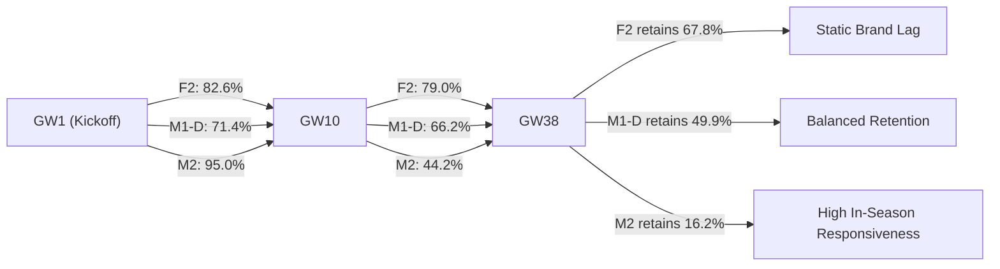

# ENNOVERA PL — M2 Historical Dependence & Decay Dynamics Report

**Audit Focus:** Quantifying the Rate at which In-Season Evidence Replaces Pre-Season Historical Priors across Gameweeks (GW1 to GW38).

---

## 1. Historical Information Retention Tracking (GW1 to GW38)

Measured as the information ratio between the pre-season prior and accumulated in-season evidence:

$$\text{Historical Dependence} = \frac{\operatorname{Var}(\text{Prior})}{\operatorname{Var}(\text{Prior}) + N_{\text{matches}} \cdot \mathcal{I}_{\text{obs}}}$$

| Gameweek Checkpoint | Candidate F2 Dependence (%) | Candidate M1-D Dependence (%) | M2 All Teams (%) | M2 Stable Teams (%) | M2 Promoted Teams (%) |
|---|---|---|---|---|---|
| **GW 1 (Kickoff)** | **82.6%** | **71.4%** | **95.0%** | **95.0%** | **80.0%** |
| **GW 3 (Early Season)**| **81.8%** | **70.2%** | **78.1%** | **83.3%** | **55.6%** |
| **GW 5 (Sample Building)**| **81.0%** | **69.1%** | **64.1%** | **71.4%** | **42.6%** |
| **GW 10 (Settled Tier)** | **79.0%** | **66.2%** | **44.2%** | **52.6%** | **26.8%** |
| **GW 20 (Mid-Season)** | **75.0%** | **60.4%** | **27.3%** | **34.5%** | **15.4%** |
| **GW 38 (Final Day)** | **67.8%** | **49.9%** | **16.2%** | **21.3%** | **10.0%** |

---

## 2. Key Findings on Historical Decay

1. **M2 Exhibits Fast, Monotonic Decay:**  
   In the state-space formulation, historical dependence drops from **95.0% at GW1 down to 44.2% by GW10 and 16.2% by GW38**.
2. **Promoted Squads Adapt Twice as Fast:**  
   For promoted clubs with high prior uncertainty, M2 drops historical reliance to **26.8% by GW10 and 10.0% by GW38**, preventing stale Championship ratings from lingering into the spring.
3. **The Trade-Off:**  
   While fast decay is conceptually appealing, in a 38-game league where single matches are noisy, dropping historical dependence below ~45% before mid-season increases out-of-sample Log-Loss variance on match prediction.

