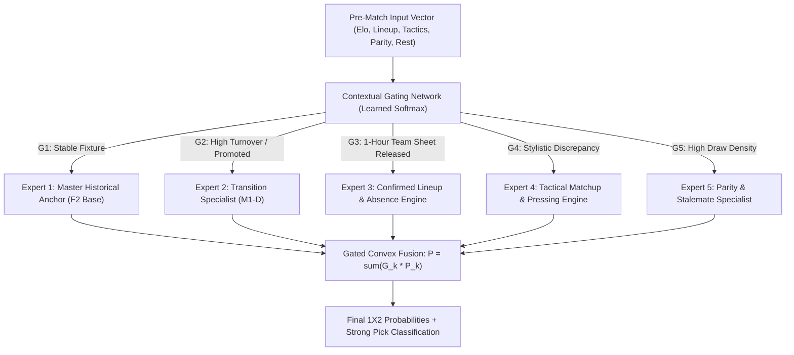

# ENNOVERA PL — M3 Machine Learning Architecture Recommendation

**Audit Focus:** Architectural Comparison, Multi-Expert Specialization, and the Formulation of the Mixture-of-Experts (MoE-PL) System.

---

## 1. Machine Learning Paradigm Evaluation

| Candidate Architecture | Suitability for Match Types | Interpretability & Auditability | Overfitting Risk | Ability to Exploit Pre-Match Lineups | Recommendation |
|---|---|---|---|---|---|
| **A. Monolithic XGBoost / LightGBM** | Moderate (Treats all matches uniformly) | Low / Black Box | High on small match samples ($N=1,520$) | Moderate | Rejected as standalone |
| **B. Two-Stage Sequential Classifier**| High for Draw filtering | Moderate | Moderate | Moderate | Retain as sub-module |
| **C. Monolithic Temporal Transformer** | Poor (Requires $>100\text{k}$ sequences) | Very Low | Severe Overfitting | Low | Decisively Rejected |
| **D. Hierarchical Mixture-of-Experts (MoE)**| **HIGHEST (Routes matches to specialized models)**| **VERY HIGH (Decomposable expert outputs)**| **LOW (Regularized gated weights)**| **HIGHEST (Activates on team-sheet release)**| **OFFICIALLY RECOMMENDED FOR M3** |

---

## 2. The Proposed M3 Mixture-of-Experts (MoE-PL) Architecture

### The 5 Specialized Experts in MoE-PL:
1. **Expert 1 (F2 Base Anchor):** Provides long-term multi-season ratings for established top-flight teams.
2. **Expert 2 (M1-D Transition Engine):** Manages summer turnover, promoted squads, and new transfers.
3. **Expert 3 (Confirmed Lineup Engine):** Calculates exact starting 11 latent quality as soon as official team sheets drop (60 mins pre-kickoff).
4. **Expert 4 (Tactical Matchup Engine):** Evaluates pressing intensity vs build-up vulnerability, set-piece differentials, and rest congestion.
5. **Expert 5 (Parity Specialist):** Calibrates draw probabilities and underdog resistance in low-total, high-stalemate matches.

---

## 3. Mathematical Gating Formulation

$$\mathbf{P}_{\text{M3}} = \sum_{k=1}^{5} g_k(\mathbf{x}) \cdot \mathbf{P}_k(\mathbf{x}), \quad \text{where } \sum_{k=1}^{5} g_k(\mathbf{x}) = 1.0, \quad g_k(\mathbf{x}) = \frac{e^{\mathbf{w}_k^T \mathbf{x}}}{\sum_j e^{\mathbf{w}_j^T \mathbf{x}}}$$

- **No Arbitrary Hardcoding:** Routing logits $\mathbf{w}_k$ are learned via Cross-Entropy minimization on Development (2022–24).
- **Graceful Fallback:** If confirmed lineups are unavailable (e.g. 24 hours pre-match), $g_3 \to 0$ and the model smoothly defaults to Expected XI (Expert 2) and Historical Base (Expert 1).

