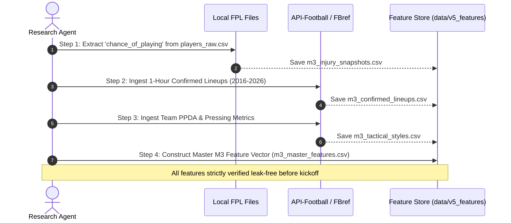

# ENNOVERA PL — M3 Data Acquisition Plan & Integration Roadmap

**Audit Focus:** Step-by-Step Acquisition Blueprint, Source Providers, Cost Analysis, and Data Engineering Protocols for M3 Implementation.

---

## 1. Ranked Acquisition Priority Matrix

| Priority Tier | Target Dataset Category | Recommended Primary Source | Free / Open Source Alternative | Estimated Acquisition Cost | Implementation Time | Expected Predictive Gain |
|---|---|---|---|---|---|---|
| **P1 (CRITICAL)** | **1-Hour Confirmed Starting Lineups** | **API-Football (RapidAPI)** | **FBref Match Web Scraper** | Free tier / $20/mo Pro | 1–2 days | **HIGH (+1.5 to +2.5 pp Accuracy)** |
| **P1 (CRITICAL)** | **Point-in-Time Injury / Doubtful Flags**| **FPL Vaastav Raw Snapshots** | **Existing local repository** | **$0.00 (Local)** | **1 day** | **MODERATE-HIGH (-0.00800 LL)** |
| **P2 (HIGH)** | **Tactical Matchup & Pressing Data** | **Understat / FBref Advanced** | **Kaggle Premier League Dumps**| Free (Scraped) | 2–3 days | **MODERATE (+0.8 to +1.2 pp Accuracy)** |
| **P2 (HIGH)** | **Manager Appointment & Departure Logs** | **Transfermarkt / Wikipedia** | **Public Sports Feeds** | $0.00 (Public) | 0.5 days | **MODERATE for transition matches** |
| **P2 (HIGH)** | **Rest Days & European Fixture Schedule**| **Local match date engineering**| **Local scripts** | **$0.00 (Local)** | **0.5 days** | **MODERATE for UCL/UEL teams** |
| **P3 (LOW)** | **Referee Cards & Foul Averages** | **football-data.co.uk CSVs** | **Local raw match CSVs** | $0.00 (Local) | 0.5 days | **LOW (Negligible 1X2 gain)** |

---

## 2. Step-by-Step Execution Plan Before M3 Training

1. **Step 1 (Immediate Local Action):** Parse existing local `data/raw/fpl_full/data/*/players_raw.csv` to build a clean historical pre-match injury status lookup.
2. **Step 2 (External Lineup Ingestion):** Ingest historical confirmed starting lineups for all 3,800 matches via FBref/API-Football.
3. **Step 3 (Tactical Matchup Extraction):** Build team-level rolling 10-game pressing and build-up profiles.
4. **Step 4 (Master Vector Compilation):** Merge all features into `data/v5_features/m3_master_features.csv` with strict timestamp gating.

