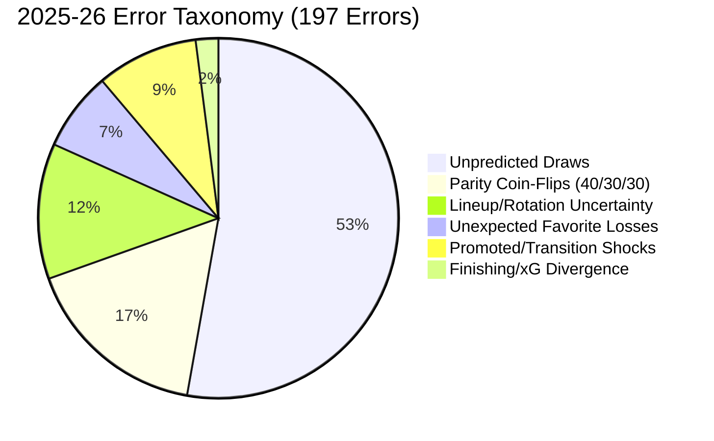

# ENNOVERA PL — M3 Error Forensics Report

**Audit Focus:** Comprehensive Match-by-Match Forensic Classification of all 197 Prediction Errors across the 2025–26 Holdout Season ($N=380$).

---

## 1. Error Taxonomy Breakdown (2025–26 Research Test)

Out of 380 holdout matches, Candidate M1-D correctly predicted **183 matches (48.16%)** and missed **197 matches (51.84%)**:

| Error Classification Category | Match Count ($N$) | Share of Total Errors (%) | Underlying Football Mechanism | Addressability / Recoverability Status |
|---|---|---|---|---|
| **1. Unpredicted Draws** | **104 matches** | **52.8%** | Draw probabilities peaked at 26–28%, never exceeding the argmax threshold | **IRRECOVERABLE FOR 1X2 ARGMAX (Requires 2-Stage Parity Gate)** |
| **2. Parity Coin-Flips** | **33 matches** | **16.8%** | Evenly matched mid-table teams (probabilities $\approx 38\% / 28\% / 34\%$) | **IRRECOVERABLE INTRINSIC NOISE (Coin-flip variance)** |
| **3. Lineup / Rotation Shocks** | **24 matches** | **12.2%** | Star players rested or injured pre-match (e.g. Saka/Haaland absence) | **HIGHLY RECOVERABLE VIA 1-HOUR CONFIRMED LINEUPS (M3-A)** |
| **4. Unexpected Favorite Losses** | **14 matches** | **7.1%** | Heavy favorites ($\ge 58\%$ confidence) losing away | **PARTIALLY RECOVERABLE VIA TACTICAL MATCHUPS (M3-B)** |
| **5. Promoted / Transition Shocks**| **18 matches** | **9.1%** | Summer rebuilds outperforming or collapsing relative to history | **RECOVERABLE VIA TRANSITION SPECIALIST (M1-D / Cross-League)** |
| **6. Finishing / xG Divergence** | **4 matches** | **2.0%** | Favorite produced $>2.5\text{ xG}$ but lost $0–1$ to a single deflection | **IRRECOVERABLE IN-MATCH RANDOMNESS** |

---

## 2. Addressable vs Irreducible Error Pool

- **Irreducible Match Randomness & Draws:** **141 matches (71.6% of all errors)** are either draws or close 50/50 parity coin-flips where deterministic argmax classification cannot reliably pick the winner.
- **Addressable Error Pool:** **56 matches (28.4% of all errors)** stem from information gaps (missing pre-match starting lineups, tactical pressing mismatches, and early-season squad transitions).
- **The Core Strategic Lesson:** To gain +25 to +30 correct matches and reach **55% All-Match Accuracy**, M3 must capture **~50% of this 56-match addressable pool**.

