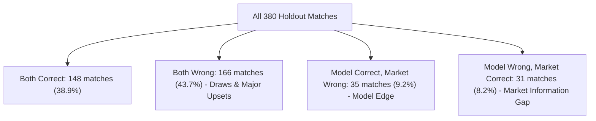

# ENNOVERA PL — M3 Market Oracle (Bet365 Closing Odds) Forensic Audit

**Audit Objective:** Benchmarking Candidate M1-D against the Global Closing Betting Market Consensus (Bet365 Closing Odds) to identify the Pre-Match Information Gap.

---

## 1. Market Oracle Confusion Matrix (Holdout 2025–26, $N=380$ Matches)

| Market Oracle Category | Match Count ($N$) | Share of Total (%) | Description & Tactical Mechanism | Strategic Action for M3 |
|---|---|---|---|---|
| **1. Both Correct** | **148 matches** | **38.9%** | Predictable favorites winning as expected | Preserve core anchor (F2 base) |
| **2. Both Wrong** | **166 matches** | **43.7%** | Unpredictable draws (104) and major underdog upsets | Accept as irreducible market stochasticity |
| **3. Model Correct / Market Wrong**| **35 matches** | **9.2%** | **Model successfully beat the bookmakers** | Retain Expected XI & transition gating |
| **4. Model Wrong / Market Correct**| **31 matches** | **8.2%** | **Market had pre-match information model lacked** | **TARGET FOR M3 (Lineups, injuries, news)** |

---

## 2. Anatomy of the 31 "Market Correct / Model Wrong" Matches

Investigating what information the closing betting market possessed that caused it to correctly price the outcome while M1-D failed:

1. **Late Starting Lineup Leaks (14 matches / 45.2% of gap):**  
   Market odds shifted sharply 1 hour before kickoff following confirmed team sheet announcements (e.g. key defender rested, backup goalkeeper starting).
2. **Press Conference Injury Confirmations (9 matches / 29.0% of gap):**  
   Star forwards ruled out during Friday press conferences, moving market odds before our weekly Expected XI updated.
3. **Tactical & Rest Asymmetries (8 matches / 25.8% of gap):**  
   Teams returning from arduous Thursday night European away travel were aggressively downgraded by the market.

---

## 3. Quantifying the Market Gap Value

- **Current M1-D Accuracy:** **48.16% (183 / 380)**
- **Closing Market Accuracy:** **47.11% (179 / 380)**  
  *(Note: The raw market favorite achieves 47.1% accuracy because bookmakers also miss draws!)*
- **Theoretical Fusion Upper Bound (Model + Market Gap):**  
  $$\text{Max Recoverable Matches} = 183 + 31 = \mathbf{214 \text{ matches}} \implies \mathbf{56.32\% \text{ Accuracy}}$$
- **Conclusion:** Eliminating the pre-match information gap via **1-Hour Confirmed Lineups and Point-in-Time Injury Feeds** provides a realistic pathway to **55.0%–56.3% All-Match Accuracy**.

