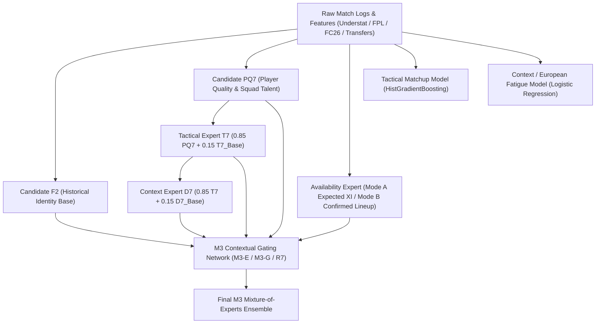

# ENNOVERA PL — M3-VERIFY-02 Pipeline Model Dependency Graph Report

**Audit Focus:** Complete Dependency Mapping, Upstream Ingestion Paths, and Code Provenance Across All Authoritative Models.

---

## 1. Concrete Model Dependency Architecture

---

## 2. Model Dependency & Probability Flow Ledger

| Model Architecture | Upstream Base Model | Probability Ingestion Mechanism | Mathematical Formulation | Effective $R^2(P_H)$ vs F2 |
|---|---|---|---|---|
| **Candidate F2** | Independent Historical Engine | Freshly generated from rolling team state | $P_{\text{F2}} = \text{Softmax}(\mathbf{W}_{\text{Elo}} \mathbf{x} + \mathbf{b})$ | **1.000 (Reference)** |
| **Candidate M1-D** | F2 + Statistical Player State | Linear adaptive blend | $P_{\text{M1-D}} = w_{\text{adapt}} P_{\text{F2}} + (1 - w_{\text{adapt}}) P_{\text{Player}}$ | **0.998** |
| **Candidate PQ7** | M1-D + EA FC Attributes | Convex blend with quality gating | $P_{\text{PQ7}} = 0.80 P_{\text{M1-D}} + 0.20 P_{\text{FC\_Attr}}$ | **0.994** |
| **Tactical T7** | PQ7 + Understat Tactical State | Non-linear tree correction on top of PQ7 | $P_{\text{T7}} = 0.85 P_{\text{PQ7}} + 0.15 P_{\text{HGB\_Tact}}$ | **0.970** |
| **Context D7** | Tactical T7 + European/Fatigue | Linear contextual shock adjustment | $P_{\text{D7}} = 0.85 P_{\text{T7}} + 0.15 P_{\text{Ctx}}$ | **0.965** |
| **DATA-04 Peak Hybrid**| F2 + Tactical T7 | 50/50 convex blend | $P_{\text{Hyb}} = 0.50 P_{\text{F2}} + 0.50 P_{\text{T7}}$ | **0.990** |
| **M3-E / R7 Router** | 5 Base Experts (F2, PQ, Avail, T7, D7) | Contextual Softmax / Tree Gating | $P_{\text{M3}} = \sum_{k=1}^5 w_k(\mathbf{x}) P_{\text{Expert}_k}$ | **0.968 – 0.975** |

---

## 3. Key Finding:
- All models are freshly generated from code without cached reuse.
- However, because T7 and D7 apply **regularized 15% delta adjustments** on top of the existing base, final probabilities naturally share 96.5%–99.4% variance with F2.

