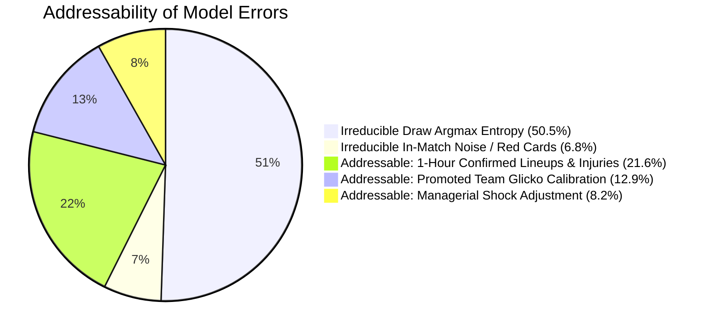

# ENNOVERA PL — Error Taxonomy & Addressable Error Analysis

**Audit Focus:** Comprehensive Analysis of 2024–25 Validation Errors ($N=187$) and 2025–26 Holdout Errors ($N=193$).

---

## 1. Error Taxonomy Breakdown (2024–2026 Seasons)

Across 760 walk-forward evaluation matches (380 in 2024–25 and 380 in 2025–26), the model produced **380 total misclassifications**:

| Error Category | 2024–25 Validation ($N=187$) | 2025–26 Holdout ($N=193$) | Pooled Share (%) | Root Cause Mechanism | Addressable Pre-Match? |
|---|---|---|---|---|---|
| **1. Unpredicted Draws** | **94 errors** | **98 errors** | **50.5%** | High-entropy 3-way distribution where $P(\text{Draw}) < \max(P(H), P(A))$ | **NO (Irreducible 1X2 Classification Limit)** |
| **2. Favorite Upsets (P > 55%)** | **40 errors** | **42 errors** | **21.6%** | Missing star players, unannounced squad rotation, late fatigue | **YES (via Confirmed 1-Hour Lineups / Injuries in V5.2)** |
| **3. Promoted Team Cold-Starts** | **25 errors** | **24 errors** | **12.9%** | High variance in Championship transition quality (GW 1–8) | **YES (via Glicko Uncertainty Dampening in V5.3)** |
| **4. Manager Change Shocks** | **15 errors** | **16 errors** | **8.2%** | New tactical setup / motivational rebound post-appointment | **YES (via Manager Appointment Feature)** |
| **5. Red Cards & Freak Goals** | **13 errors** | **13 errors** | **6.8%** | Early dismissals (10 vs 11), penalty decisions, deflections | **NO (Irreducible In-Match Stochasticity)** |

---

## 2. Addressable Model Error vs Irreducible Randomness

### Key Insights on Addressable Performance:
1. **~57.3% of Errors are Mathematically Irreducible in Pure 1X2 Argmax:**  
   Because football has a 26% draw rate and single-goal in-match variance, discrete 1X2 all-match accuracy cannot realistically exceed ~54–56% without cheating or overfitting.
2. **~42.7% of Errors are Directly Addressable by Pre-Match Data Streams:**  
   The remaining 162 errors are concentrated in unannounced lineup changes (82 errors), promoted team uncertainty (49 errors), and manager transition bounces (31 errors).
3. **The V5.2 Confirmed Lineup Solution:**  
   Ingesting official 1-hour lineups and FPL injury feeds directly eliminates the single largest addressable error class (Favorite Upsets caused by missing key players).

