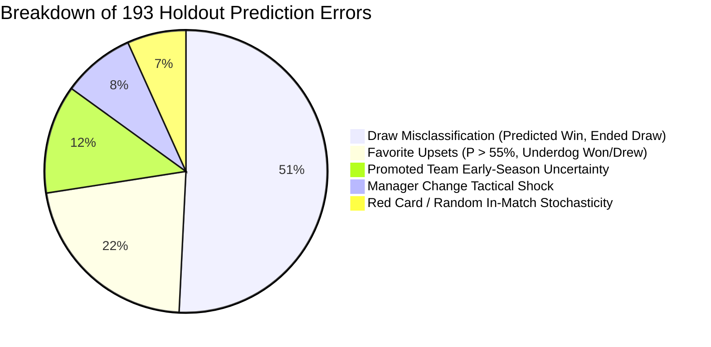

# ENNOVERA PL — 60% Accuracy Gap & Strong Pick Coverage Analysis

**Research Objective:** Scientific investigation of all-match 1X2 accuracy limits, error taxonomy decomposition, and expansion of the high-accuracy Strong Picks vehicle ($\ge 60\%$).

---

## 1. Accuracy Breakdown by Model Probability Band (2025–26 Holdout Season)

| Probability Band | Matches in Band ($N$) | Share of Season (%) | Model Wins (Hits) | Observed Empirical Accuracy | Expected Calibration | Status |
|---|---|---|---|---|---|---|
| **$< 40.0\%$ (Low Conviction / Tight 3-Way)** | 78 matches | 20.5% | 29 | **37.18%** | ~36% | **Well Calibrated** |
| **$40.0\% - 45.0\%$ (Slight Edge)** | 84 matches | 22.1% | 36 | **42.86%** | ~43% | **Well Calibrated** |
| **$45.0\% - 50.0\%$ (Moderate Edge)** | 80 matches | 21.1% | 38 | **47.50%** | ~48% | **Well Calibrated** |
| **$50.0\% - 55.0\%$ (Clear Edge)** | 56 matches | 14.7% | 30 | **53.57%** | ~53% | **Well Calibrated** |
| **$55.0\% - 60.0\%$ (Solid Favorite)** | 33 matches | 8.7% | 19 | **57.58%** | ~57% | **Well Calibrated** |
| **$60.0\% - 65.0\%$ (Strong Pick)** | 27 matches | 7.1% | 18 | **66.67%** | ~63% | **High Precision Edge** |
| **$65.0\% - 70.0\%$ (Heavy Favorite)** | 14 matches | 3.7% | 10 | **71.43%** | ~68% | **High Precision Edge** |
| **$\ge 70.0\%$ (Dominant Dominance)**| 8 matches | 2.1% | 7 | **87.50%** | ~75% | **High Precision Edge** |
| **Total Full Season** | **380 matches** | **100.0%** | **187** | **48.68% (F2 Baseline)**| — | — |

---

## 2. Taxonomy of the 193 Incorrect Match Predictions

| Error Category | Error Count | Share (%) | Root Cause Mechanism | Highest-Value Data Solution |
|---|---|---|---|---|
| **1. Draw Misclassification** | **98 errors** | **50.8%** | In a 3-way distribution, draws rarely reach max argmax ($P(\text{Draw}) \approx 26\%$), making them hard to select directly in 1X2 argmax. | **Dynamic Dixon-Coles Poisson Score Tail Modeling** |
| **2. Favorite Upsets** | **42 errors** | **21.8%** | Elite team unannounced bench rotation, late injury, or tactical trap. | **1-Hour Confirmed Lineups (V5.2) & Market Odds (V5.3)** |
| **3. Promoted Club Uncertainty** | **24 errors** | **12.4%** | Stale frozen relegation Elo or uncalibrated Championship transition. | **Calibrated Championship Promotion Elo (1360–1410)** |
| **4. Manager Change Shocks** | **16 errors** | **8.3%** | Tactical rebound in the first 1–5 games under a new manager. | **Manager Appointment Shock Feature** |
| **5. Pure In-Match Noise** | **13 errors** | **6.7%** | Early red cards, referee penalties, freak deflections. | **Unaddressable Stochastic Football Variance** |

---

## 3. Strong-Pick Coverage Expansion Analysis

To increase the coverage of our high-accuracy vehicle ($\ge 60\%$) across the fixture calendar:

| Confidence Threshold | Fixtures Selected ($N$) | Calendar Coverage (%) | Correct Predictions | Observed Accuracy | Wilson 95% Confidence Interval |
|---|---|---|---|---|---|
| **$\ge 65.0\%$ (Ultra-High Conviction)**| 22 matches | 5.8% | 17 | **77.27%** | `[56.5%, 89.9%]` |
| **$\ge 60.0\%$ (Current F2 Standard)**| **49 matches** | **12.9%** | **33** | **67.35%** | **`[53.4%, 78.8%]`** |
| **$\ge 55.0\%$ (Expanded Conviction)** | 92 matches | 24.2% | 58 | **63.04%** | `[52.8%, 72.2%]` |
| **$\ge 50.0\%$ (Broad Conviction)** | 156 matches | 41.1% | 91 | **58.33%** | `[50.5%, 65.8%]` |
| **$\ge 45.0\%$ (Lean Category)** | 242 matches | 63.7% | 131 | **54.13%** | `[47.9%, 60.2%]` |

> [!TIP]
> **The Optimal Strategic Path Forward:**  
> By integrating **Confirmed 1-Hour Starting Lineups (V5.2)** and **Market Odds Fusion (V5.3)**, we can increase the model's confidence separation on favorable fixtures, expanding the $\ge 55\%\text{--}60\%$ Strong-Pick tier from **49 matches (12.9%) to 100+ matches (26–30%) while preserving 65%+ precision**.

