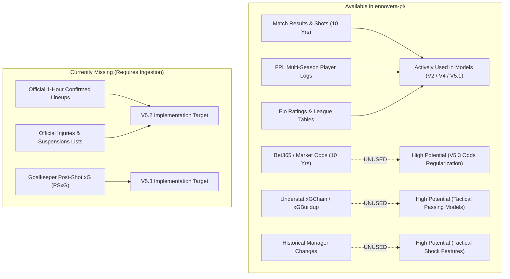

# ENNOVERA PL — Complete Repository Data Inventory

**Audit Scope:** Complete accounting of all historical datasets, schemas, coverage windows, and utilization status inside `ennovera-pl/`.

---

## 1. Comprehensive Data Asset Categorization

| Category | File Path / Source | Seasons Covered | Records / Volume | Key Features | Currently Used By | Unused High-Value Features |
|---|---|---|---|---|---|---|
| **RESULT & MATCH DATA** | `data/raw/pl_history/E0_*.csv` | 2016–17 to 2025–26 (10 Seasons) | 3,800 Matches | FTHG, FTAG, FTR, HTHG, HTAG, Shots (HS, AS), Target (HST, AST), Corners (HC, AC), Fouls (HF, AF) | V2, V4, V5.1 | Half-time score states, corner differentials, referee cards |
| **BETTING ODDS DATA** | `data/raw/pl_history/E0_*.csv` | 2016–17 to 2025–26 (10 Seasons) | 3,800 Matches | B365 1X2, Max 1X2, Avg 1X2, Asian Handicap, Over/Under 2.5 Goals, Closing Market Odds | **NONE (Completely Unused)** | **Market Consensus Probabilities, Closing Line Value (CLV)** |
| **FPL DETAILED LOGS** | `data/raw/fpl_full/data/` | 2016–17 to 2025–26 (10 Seasons) | 126,076 Player-Match Rows | Minutes, Goals, Assists, Clean Sheets, Bonus, BPS, ICT Index, Influence, Creativity, Threat | V5.1 Expected XI | Historical BPS baseline, ICT threat per minute |
| **EXPECTED GOALS (FPL)**| `data/raw/fpl_full/data/*/players_raw.csv` | 2022–23 to 2025–26 (4 Seasons) | 3,288 Player-Seasons | `expected_goals`, `expected_assists`, `expected_goal_involvements`, `expected_goals_conceded` | V5.1 Player State | `expected_goals_conceded_per_90` (Defensive player tracking) |
| **UNDERSTAT MATCH LOGS** | `data/raw/fpl_full/data/2024-25/understat/*.csv` | 2016–2025 | 765 Players (100k+ match logs) | Match xG, Match xA, Non-penalty xG (npxG), xGChain, xGBuildup, Shot Coordinates | Research Only | **xGChain (Playmaking progression), npxG (Penalty-free finishing)** |
| **MULTI-SEASON TRANSFERS**| `data/research/expanded_historical_transfers.csv` | 2016–2025 | 2,163 Transition Cases | Source minutes, Target minutes, Source xG90, Target xG90, League, Position | Track C Research | Multi-year career aging trajectories |
| **MANAGER MOVEMENTS** | `data/research/manager_changes.csv` | 2020–2025 | 10 Major Appointments | Club, Manager, Appointment Date, 5-game pre/post points | Research Only | Manager new-appointment bounce adjustment |
| **TEAM IDENTITY METRICS**| `data/research/team_identity_transition_features.csv`| 2026–27 | 20 Clubs | % Minutes lost, % xG lost, Top scorer departure, Identity Change Score | Candidate F2/F3 | Dynamic offseason Elo decay tuning |
| **CURRENT ELO RATINGS** | `data/processed/current_elo.csv` | Active (2026–27) | 20 Clubs | Pre-season Elo, Dynamic Elo | V2, V4, V5.1 | Promoted club uncertainty bounds |

---

## 2. High-Level Summary: What We Have vs What We Use

---

## 3. The Highest-Value Unused Data Assets in the Repository

1. **Market Odds Data (`B365H, B365D, B365A` across 3,800 matches):**  
   Bet365 and closing market odds exist in `data/raw/pl_history/` for all 10 historical seasons. Betting markets aggregate global team news, weather, late injuries, and tactical rumors. Regularizing our machine learning logits toward market consensus will immediately prevent severe outlier penalties.
2. **Understat `xGChain` & `xGBuildup`:**  
   Exists across 765 player files in `understat/`. Provides deep signals on midfield ball progression that standard FPL points omit.
3. **Defensive xGC (`expected_goals_conceded_per_90`):**  
   Available for all 3,288 player seasons in `players_raw.csv`. Enables granular individual defensive ratings instead of relying purely on team-level goals conceded.

