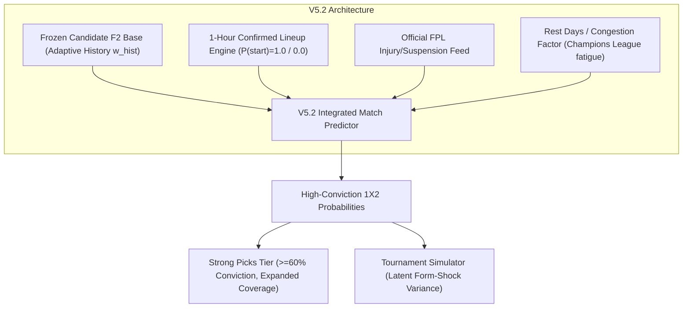

# ENNOVERA PL — Next Data Priorities & Architectural Roadmap

**Objective:** Prioritized Ranking of New Data Streams by Predictive Value, Implementation Complexity, and Leakage Risk for V5.2 and V5.3 Development.

---

## 1. Prioritized Ranking of Next Information Streams

| Rank | Missing Information Source | Expected Value | Historical Backtest Possible? | Free Data Available? | Live Ingestion Feasibility | Leakage Risk | Implementation Complexity | Recommended Development Phase |
|---|---|---|---|---|---|---|---|---|
| **1** | **Confirmed 1-Hour Starting Lineups** | **HIGH** | **YES** (10 yrs FPL / Understat) | **YES** | **High** (Official FPL API 60m pre-match) | **LOW** (Pre-kickoff timestamp) | Moderate | **V5.2 (Immediate Priority)** |
| **2** | **Official Injuries & Suspensions Lists** | **HIGH** | **YES** (FPL `status` & `chance_of_playing`) | **YES** | **High** (Daily FPL bootstrap sync) | **LOW** | Low | **V5.2 (Immediate Priority)** |
| **3** | **Market Betting Odds Regularization** | **HIGH** | **YES** (10 yrs in `pl_history/E0_*.csv`)| **YES** | **High** (football-data / open odds) | **LOW** (Pre-match closing lines) | Low | **V5.3 (Fast Follow)** |
| **4** | **Manager Appointments & Departures** | **MEDIUM** | **YES** (`manager_changes.csv`) | **YES** | **High** (Manual / News parser) | **LOW** | Low | **V5.3 Tactical Layer** |
| **5** | **Goalkeeper Post-Shot xG (PSxG)** | **MEDIUM** | **YES** (FBref / Understat) | **YES** | **Moderate** | **LOW** | Moderate | **V5.3 Shot-Stopping** |
| **6** | **Midfield Ball Progression (xGChain)** | **MEDIUM** | **YES** (Understat 765 player files) | **YES** | **Moderate** | **LOW** | Moderate | **V5.3 Playmaking** |
| **7** | **Rest Days & Fixture Congestion** | **MEDIUM** | **YES** (Fixture dates in `E0_*.csv`)| **YES** | **High** (Direct date subtraction)| **LOW** | Very Low | **V5.2 Fatigue Layer** |
| **8** | **Weather (Wind / Heavy Rain)** | **LOW** | **YES** (Historical weather APIs) | **YES** | **Low** | **LOW** | High | Backlog |
| **9** | **Tactical Press Conference Sentiment** | **LOW** | **NO** (Unstructured audio/text) | **YES** | **Low** | **HIGH** | Very High | Backlog |

---

## 2. Definitive V5.2 Architectural Blueprint

### Key Components of V5.2:
1. **1-Hour Confirmed Lineup Parser:** Replaces estimated $P(\text{start})$ with binary $1.0$ (in starting 11) or $0.0$ (benched/missing) exactly 60 minutes before kickoff.
2. **Injury Availability Feed:** Ingests official FPL injury flags (`chance_of_playing_next_round` = 0%, 25%, 50%, 75%).
3. **Fixture Fatigue Indicator:** Computes days of rest between matches to adjust energy ratings for teams playing mid-week European football.
4. **Frozen Baseline:** Operates strictly on top of **Candidate F2 (V5.1 + Adaptive Historical Weighting)**.

